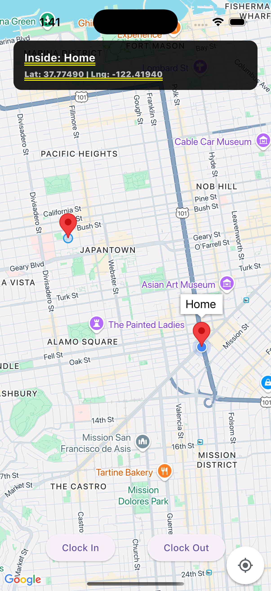
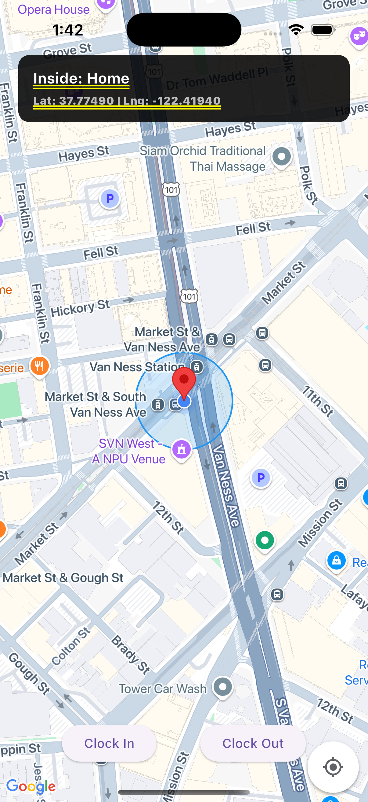
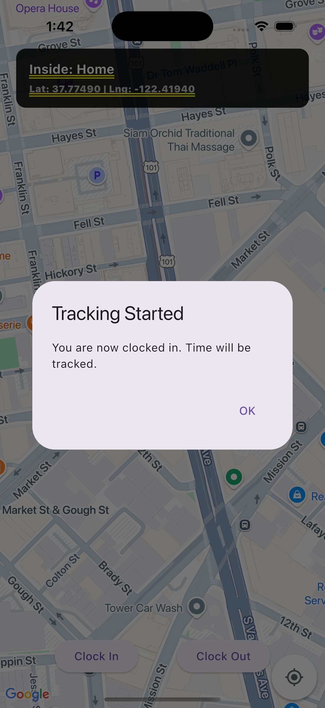
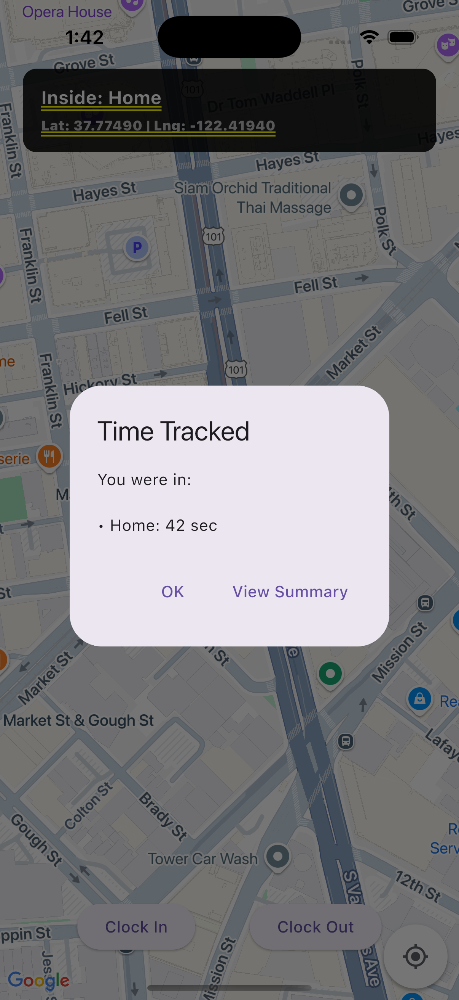
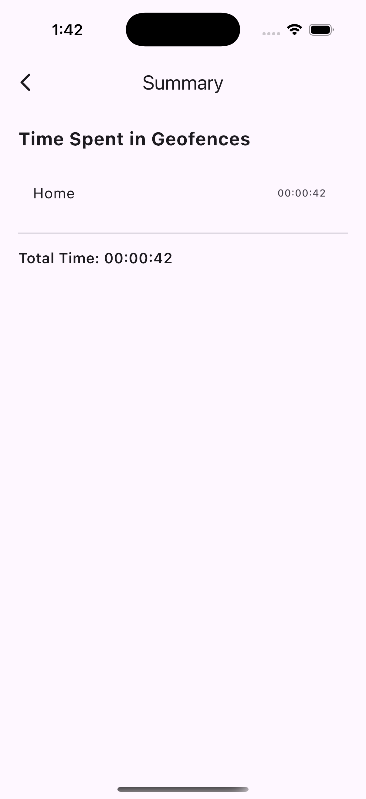

```bash
                ,---.-,                  
   ,---.-,     '   ,'  '.                
  '   ,'  '.  /   /      \      ,----,   
 /   /      \.   ;  ,/.  :    .'   .' \  
.   ;  ,/.  :'   |  | :  ;  ,----,'    | 
'   |  | :  ;'   |  ./   :  |    :  .  ; 
'   |  ./   :|   :       ,  ;    |.'  /  
|   :       , \   \     /   `----'/  ;   
 \   \      |  ;   ,   '\     /  ;  /    
  `---`---  ; /   /      \   ;  /  /-,   
     |   |  |.   ;  ,/.  :  /  /  /.`|   
     '   :  ;'   |  | :  ;./__;      :   
     |   |  ''   |  ./   :|   :    .'    
     ;   |.' |   :      / ;   | .'       
     '---'    \   \   .'  `---'          
               `---`-'                   
```
# Location Tracker App

This app tracks the user's time spent in predefined geofenced locations (e.g., Home and Office), displaying real-time location on a map and summarizing durations. Built using **Flutter** and follows a clean Provider-based architecture.

---

## Preview

### Main Screen
<p align="center">
  
</p>
<p align="center">
  
</p>

### Clocking In
<p align="center">
  
</p>

### Clocking Out
<p align="center">
  
</p>

### Summary Screen
<p align="center">
  
</p>

---

## Features

- ✅ Live location tracking (with permissions)
- ✅ Geofenced area detection (entry/exit)
- ✅ Tracks duration inside each geofence
- ✅ Google Map with visual markers and circles
- ✅ Bottom tab navigation (Main / Summary)
- ✅ Summary screen with time breakdown
- ✅ Responsive UI with animation and styling

---

## Architecture

- **State Management**: `provider`
- **Map**: `google_maps_flutter`
- **Location**: `location`
- **Reverse Geocoding**: `geocoding`
- **Design**: Custom widgets, `GlassContainer`, animated tab bar

```
lib/
├── main.dart
├── models/           # GeoFence & Location models
├── providers/        # Location & Geofence logic
├── screens/          # MainScreen, SummaryScreen, SecondScreen
├── widgets/          # MapView, reusable UI components
└── util/             # Notification helper, etc.
```

---

## How It Works

1. On launch, asks for location permission.
2. Displays map centered on first geofence.
3. Press **"Start Tracking"** to begin tracking.
4. App checks geofence containment every 5 seconds.
5. Press **"Summary"** to stop tracking and see results.

---

## Setup

### 1. Clone the repo

```bash
git clone https://github.com/fabiojosue/Flutter-Location-App.git
cd flutter-location-app
```

### 2. Install dependencies

```bash
flutter pub get
cd ios
pod install
cd ..
```

### 3. Configure `.env`

Create a `.env` file based on `.env.example`:

```env
FIREBASE_API_KEY=...
FIREBASE_APP_ID=...
FIREBASE_MESSAGING_SENDER_ID=...
FIREBASE_PROJECT_ID=...

GOOGLE_MAPS_API_KEY=...
APP_NAME=Location Tracker
APP_ENV=development
DEBUG=true
```

### 4. iOS Notes

- Enable permissions in `ios/Runner/Info.plist`:
  ```xml
  <key>NSLocationWhenInUseUsageDescription</key>
  <string>This app needs your location to track visits to geofenced areas.</string>
  <key>NSLocationAlwaysUsageDescription</key>
  <string>This app requires location even in the background.</string>
  <key>NSLocationAlwaysAndWhenInUseUsageDescription</key>
  <string>This app needs location access to work properly.</string>
  <key>NSLocalNetworkUsageDescription</key>
  <string>Required for Dart VM Service debugging</string>
  <key>NSBonjourServices</key>
  <array>
    <string>_dartobservatory._tcp</string>
  </array>
  ```

- Firebase must be initialized in `AppDelegate.swift`:
  ```swift
  import FirebaseCore
  FirebaseApp.configure()
  ```

---

## Notes

- ✅ All logic modularized and testable
- ✅ Geofencing based on Haversine distance
- ⚠️ For demo purposes, two hardcoded locations: **Home** and **Office**

---

## Author

Fabio — *Software Engineer*
